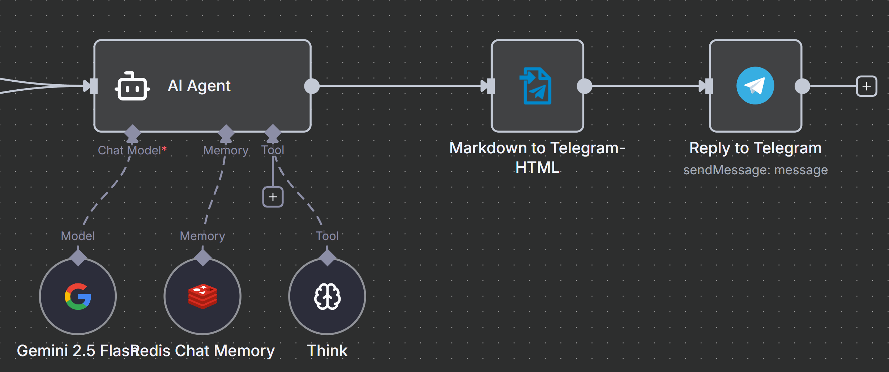
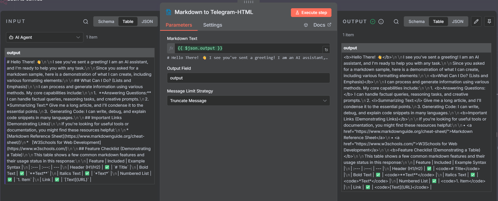

# Markdown to Telegram-HTML n8n Node

This repository contains a custom **n8n node** that converts **Markdown** into **Telegram-compatible HTML**.  
It preserves Telegram-specific features (like spoilers using `||spoiler||`) and formats standard Markdown into HTML that Telegram accepts.



Based on [andresberrios/n8n-nodes-telegram-better-markdown](https://github.com/andresberrios/n8n-nodes-telegram-better-markdown).

---

## 📘 Overview

This node is designed to:
- Accept a Markdown string and convert it into Telegram-safe HTML.
- Handle Telegram's 4096-character message limit intelligently.
- Allow customization of output field names and overflow strategies.

---

## ⚙️ Node Properties

| Property                   | Type      | Default         | Description                                                               |
|----------------------------|-----------|-----------------|---------------------------------------------------------------------------|
| **Markdown Text**          | `string`  | —               | The Markdown content to convert.                                          |
| **Output Field**           | `string`  | `telegram_html` | Field name in the output JSON containing the generated HTML.              |
| **Message Limit Strategy** | `options` | `truncate`      | Strategy for handling messages exceeding Telegram's 4096-character limit. |

---

## 🧩 Message Limit Strategies

Telegram limits messages to **4096 characters**.  
This node provides two ways to handle longer content:

### 1. `truncate` — Truncate Message

**Behavior:**  
The generated HTML is truncated to a safe boundary (avoiding broken tags) and appends ` [...]` to indicate omitted content.

**Use Case:**  
When you only need one message output and can tolerate trimming the end.

---

### 2. `split` — Split Message

**Behavior:**  
The HTML is split into multiple parts (each ≤4096 characters).  
Splitting preserves HTML integrity and returns multiple output items — one per chunk — with the same original data except for the updated `Output Field`.

**Use Case:**  
When you want to send the entire message as multiple consecutive Telegram messages without breaking formatting.

---

### Notes on Behavior

- The node uses helper functions that **tokenize HTML** and prefer to cut at safe points (e.g., closed tags or line breaks).  
- In `truncate` mode, a ` [...]` suffix is appended.  
- In `split` mode, each chunk becomes a separate output item — downstream nodes (like Telegram Send Message) will process each part independently.

---

## 🧪 Example Outputs

### `truncate` Mode

```json
{
  "telegram_html": "<p>This is a long message... [...]</p>"
}
```

A single output item is returned with truncated HTML.

### `split` Mode

```json
[
  { "telegram_html": "<p>Part 1 of the message...</p>" },
  { "telegram_html": "<p>Part 2 of the message...</p>" }
]
```

Multiple items are returned, each containing a valid HTML chunk.

---

## 🧰 Local Development

### 1. Install Dependencies

```bash
npm install
```

### 2. Run in Development Mode

```bash
npm run dev
```


### 3. Run unit test

```bash
npm test -- --coverage --runInBand
```

---

## 🧠 Usage in n8n

1. Add the **Markdown to Telegram-HTML** node to your workflow.
2. Provide your Markdown content in the **Markdown Text** field.
3. Optionally change the **Output Field** name (default: `telegram_html`).
4. Choose a **Message Limit Strategy**:
   - `truncate` for a single, shortened message.
   - `split` for multiple message chunks.


